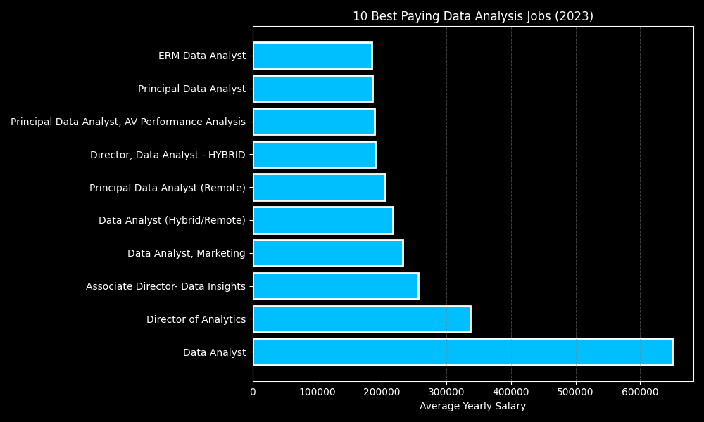
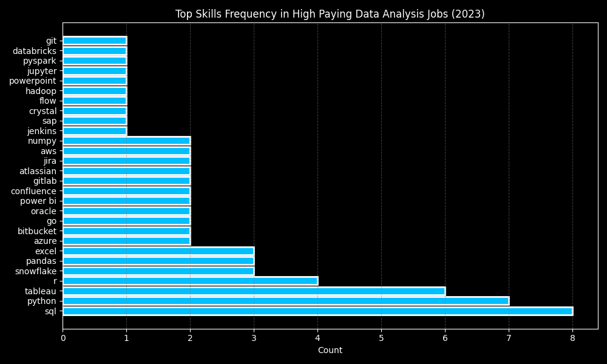

# Introduction
This projects looks at job posting data for data analyst jobs and analyzes which skills are most useful to learn.

SQL queries are in the [project_sql folder](project_sql/)
# Background

The dataset comes from the [SQL Course](https://www.lukebarousse.com/sql) by Luke Barousse. It includes a wide range of data-related job postings from 2023, not limited to data analyst positions.
# Questions I aimed to answer with the SQL queries
1. What are the highest-paying data analyst jobs?
2. What skills do the highest-paying data analyst jobs require?
3. Which skills are most frequently required for data analysis roles?
4. Which skills have the highest average pay?
5. Which skills offer the best combination of demand and pay?

# Tools I Used

- **SQL**: Core tool for querying and analyzing the data.
- **PostgreSQL**: Local database management system.
- **VS Code**: Development environment for writing SQL and Python code.
- **Git & GitHub**: Version control and project management.
- **Python**: Used for data visualization.

# The Analysis

### 1. Top Paying Data Analyst Jobs

This query was designed to identify the highest-paying data analyst positions by location and average yearly salary.

```sql
SELECT job_id,
    job_title,
    job_location,
    job_schedule_type,
    salary_year_avg,
    job_posted_date,
    name AS company_name
FROM job_postings_fact
    LEFT JOIN company_dim ON job_postings_fact.company_id = company_dim.company_id
WHERE job_location IN ('Warsaw, Poland', 'Anywhere')
    AND job_title_short = 'Data Analyst'
    AND salary_year_avg IS NOT NULL
ORDER BY salary_year_avg DESC
LIMIT 10;
```

**Key takeaways**:

- **Diverse employers**: The top 10 positions are spread across 9 different companies.
- **High salary potential**: Average annual salaries for these roles are around 180,000, indicating strong earning potential in the highest-paying positions.
- **Variety in job titles**: This suggests that specialization or niche skills may play a role in securing the top-paying jobs.



### 2. Top Paying Data Analyst Job Skills

This query identifies the skills most commonly required for the highest-paying data analyst roles, helping to highlight which tools and knowledge are in demand.

```sql
WITH top_paying_jobs AS (
    SELECT job_id,
        job_title,
        salary_year_avg,
        name AS company_name
    FROM job_postings_fact
        LEFT JOIN company_dim ON job_postings_fact.company_id = company_dim.company_id
    WHERE job_location IN ('Warsaw, Poland', 'Anywhere')
        AND job_title_short = 'Data Analyst'
        AND salary_year_avg IS NOT NULL
    ORDER BY salary_year_avg DESC
    LIMIT 10
)
SELECT top_paying_jobs.*,
    skills
FROM top_paying_jobs
    INNER JOIN skills_job_dim ON top_paying_jobs.job_id = skills_job_dim.job_id
    INNER JOIN skills_dim ON skills_dim.skill_id = skills_job_dim.skill_id
ORDER BY salary_year_avg DESC
```



**Key takeaways**:

- **SQL is universal**: It appears in 100% of the top-paying roles.
- **Python is highly common**: Required in 87.5% of these positions.
- **Other frequent tools**: Tableau appears in 75% of jobs, while R is listed in 50%.
- **Top skill combination**: Python + SQL is the most common pairing, present in 7 of 8 roles (87.5%).
- **Cloud and big-data tools**: Snowflake, AWS, Azure, and Databricks appear in several listings. Databricks, PySpark, and Jupyter are concentrated in the single highest-paid role, suggesting specialized expertise may command premium salaries.


### 3. Most In-Demand Data Analysis Skills

This query identifies the skills most frequently listed in data analyst job postings, highlighting the core competencies sought by employers.

```sql
SELECT skills_dim.skills AS skill_name,
    COUNT(*) AS job_count
FROM job_postings_fact
    INNER JOIN skills_job_dim ON job_postings_fact.job_id = skills_job_dim.job_id
    INNER JOIN skills_dim ON skills_dim.skill_id = skills_job_dim.skill_id
WHERE job_postings_fact.job_title_short = 'Data Analyst'
GROUP BY skills_dim.skills
ORDER BY job_count DESC
LIMIT 10;
```


| Skill Name | Job Count |
|------------|-----------|
| sql        | 92,628    |
| excel      | 67,031    |
| python     | 57,326    |
| tableau    | 46,554    |
| power bi   | 39,468    |
| r          | 30,075    |
| sas        | 28,068    |
| powerpoint | 13,848    |
| word       | 13,591    |
| sap        | 11,297    |

**Key takeaways**:

- **Database skills dominate**: SQL and Excel appear in the majority of postings, confirming their central role in data analysis.
- **Business intelligence tools are essential**: Tableau and Power BI are frequently requested for visualization and reporting.
- **Programming skills are important**: Python and R are in high demand, reflecting the need for data manipulation and statistical analysis.

### 4. Top Paying Skills

This query calculates the average salary for each skill listed in data analyst job postings, highlighting which skills tend to command the highest pay.

```sql
SELECT skills_dim.skills AS skill_name,
    ROUND(AVG(job_postings_fact.salary_year_avg), 0) AS average_pay,
    COUNT(*) AS job_count
FROM job_postings_fact
    INNER JOIN skills_job_dim ON job_postings_fact.job_id = skills_job_dim.job_id
    INNER JOIN skills_dim ON skills_dim.skill_id = skills_job_dim.skill_id
WHERE job_postings_fact.job_title_short = 'Data Analyst'
    AND job_postings_fact.salary_year_avg IS NOT NULL
GROUP BY skills_dim.skills
HAVING COUNT(*) > 10 -- getting rid of outliers
ORDER BY average_pay DESC
LIMIT 25;
```

| Skill Name  | Average Pay | Job Count |
|-------------|-------------|-----------|
| kafka       | 129,999     | 40        |
| pytorch     | 125,226     | 20        |
| perl        | 124,686     | 20        |
| tensorflow  | 120,647     | 24        |
| cassandra   | 118,407     | 11        |
| atlassian   | 117,966     | 15        |
| airflow     | 116,387     | 71        |
| scala       | 115,480     | 59        |
| linux       | 114,883     | 58        |
| confluence  | 114,153     | 62        |
| pyspark     | 114,058     | 49        |
| mongodb     | 113,608     | 52        |
| gcp         | 113,065     | 78        |


**Key takeaways**:

- **Specialized skills command higher pay:** Niche tools like Kafka, PyTorch, and Perl top the salary list, though roles requiring them are fewer.
- **Big data and machine learning remain in demand:** Tools such as Spark, Snowflake, Databricks, and TensorFlow consistently offer strong mid-to-high salaries.
- **Combine niche and core skills:** Pairing specialized expertise with foundational tools (e.g., Linux, Git, SQL) increases both earning potential and job opportunities.
 

### 5. Optimal Skills

This query identifies the skills that best balance demand and salary, combining how frequently a skill is required with its associated average pay. The resulting skill score highlights the skills that provide the greatest overall career leverage for data analysts.

```sql
WITH average_salary AS (
    SELECT skills_dim.skills AS skill_name,
        ROUND(AVG(job_postings_fact.salary_year_avg), 0) AS average_pay,
        COUNT(*) AS job_count
    FROM job_postings_fact
        INNER JOIN skills_job_dim ON job_postings_fact.job_id = skills_job_dim.job_id
        INNER JOIN skills_dim ON skills_dim.skill_id = skills_job_dim.skill_id
    WHERE job_postings_fact.job_title_short = 'Data Analyst'
        AND job_postings_fact.salary_year_avg IS NOT NULL
    GROUP BY skills_dim.skills
    HAVING COUNT(*) > 10
),
normalized AS (
    SELECT skill_name,
        job_count,
        average_pay,
        (job_count * 1.0 / MAX(job_count) OVER()) AS demand_score,
        (average_pay * 1.0 / MAX(average_pay) OVER()) AS pay_score
    FROM average_salary
)
SELECT skill_name,
    job_count,
    average_pay,
    ROUND((demand_score + pay_score) / 2, 3) AS skill_score
FROM normalized
ORDER BY skill_score DESC
LIMIT 20;
```

| Skill Name | Job Count | Average Pay | Skill Score |
|------------|-----------|-------------|-------------|
| sql        | 3,083     | $96,435     | 0.871       |
| python     | 1,840     | $101,512    | 0.689       |
| excel      | 2,143     | $86,419     | 0.680       |
| tableau    | 1,659     | $97,978     | 0.646       |
| r          | 1,073     | $98,708     | 0.554       |
| power bi   | 1,044     | $92,324     | 0.524       |
| sas        | 1,000     | $93,707     | 0.523       |
| kafka      | 40        | $129,999    | 0.506       |
| pytorch    | 20        | $125,226    | 0.485       |
| perl       | 20        | $124,686    | 0.483       |
| snowflake  | 241       | $111,578    | 0.468       |
| tensorflow | 24        | $120,647    | 0.468       |
| spark      | 187       | $113,002    | 0.465       |
| airflow    | 71        | $116,387    | 0.459       |
| azure      | 319       | $105,400    | 0.457       |
| cassandra  | 11        | $118,407    | 0.457       |
| aws        | 291       | $106,440    | 0.457       |

**Key takeaways**:

- **Core skills dominate**: SQL, Python, and Excel rank highest, showing that foundational skills remain crucial.
- **Balanced strategy matters**: Skills like Tableau, R, Power BI, and SAS offer a strong combination of demand and pay, making them strategically valuable.
- **Specialized tools can be lucrative**: Kafka, PyTorch, TensorFlow, and Snowflake have high pay but lower frequency, suggesting that niche expertise can boost salary but may limit opportunities.
- **Optimal mix**: Pairing high-demand core skills with selected specialized tools maximizes both job prospects and earning potential.

# What I Learned
Through this project, I gained hands-on experience integrating VS Code, GitHub, and PostgreSQL, which improved my workflow for managing and querying data. I also developed a stronger understanding of data analysis techniques and learned how to present results in a clear, concise, and meaningful way.

# Conclusions

This project provided several key insights into the data analyst job market:

- **High-paying roles favor specialized skills:** Tools like Kafka, PyTorch, and TensorFlow tend to appear in the highest-paying jobs, even if they are less common overall.
- **Core skills remain essential:** SQL, Python, Excel, and popular BI tools like Tableau and Power BI dominate demand, forming the foundation of most data analyst roles.
- **Balancing demand and pay is strategic:** Skills that combine high demand with strong salaries, such as SQL and Python, offer the best overall career leverage.
- **Data presentation matters:** Beyond analysis, effectively visualizing and communicating insights is crucial for translating data into actionable decisions.

Overall, the analysis shows that focusing on a mix of foundational skills, in-demand tools, and selected specialized expertise can maximize both opportunities and earning potential in data analytics.